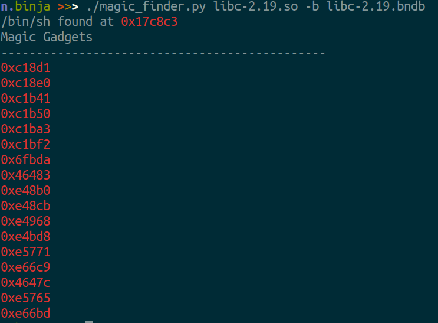
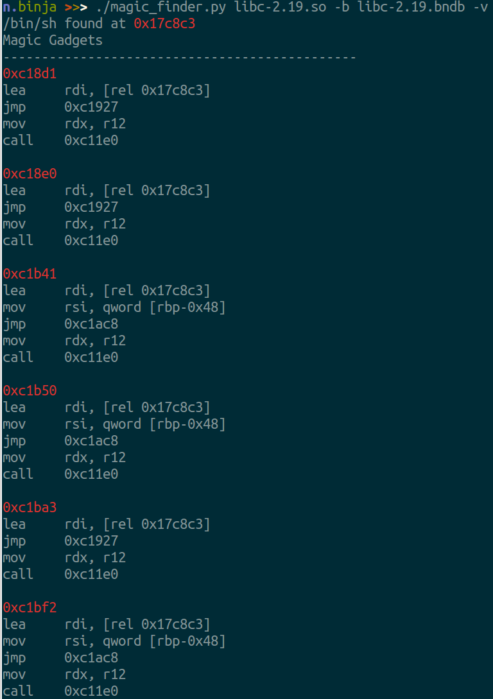

# Ida Plugin for finding the 'Magic Gadget' in libc
__credits__: (I've heard it was first discovered by _ricky_ from PPP? but I don't know, also documented [here](http://j00ru.vexillium.org/?p=2485))  
__info__:    For info on what the magic gadget is check out [this](https://kimiyuki.net/blog/2016/09/16/one-gadget-rce-ubuntu-1604/)  

## Usage
`./magic_finder.py libc-2.19.so`
`./magic_finder.py libc-2.19.so -b libc-2.19.bndb`

## Examples

  
  

## Using the output
The simplest thing to do while ctfing is just copying the output addresses and brute forcing each and hope to get lucky (no shame when it is the magic gadget), it shouldn't take too long. Or go through the verbose output or pull up the address in binary ninja or ida to have a closer look.
